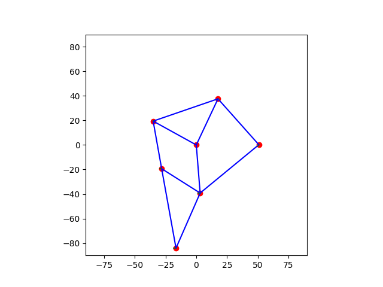

# SWD Abschlussprojekt - Planar Mechanism Simulator

## Overview

As part of the software design lecture at the [MCI - Management Center Innsbruck](https://www.mci.edu/de/), a program should have been created with Python and object-oriented programming. Another great aspect should have been the work as a team via [GitHub](https://github.com) and its version control.

**Key Features:** These key features were/should have been implemented into the program:

-   Defining **Joints** in a **Mechanism** and being able to restrict their Degree of Freedom (DoF)
-   Connecting mentioned Joints via **Links**
-   Defining a **Rotor** where Joints can be assigned to rotate around
-   Validating the Mechanism by calculating the **DOF**
-   Calculating the Mechanism by optimizing the Joint positions for 360° via **scipy.optimize** and visualizing it in an **Animation**
-   Showing the **Trajectory** of selected Joints in the animation and creating a **.csv-File** out of them in relation to the angle $\theta$
-   A **graphical user interface (GUI)** with Streamlit for easy editing and visualization of the Mechanism

**Extras:** In addition to the key features and minimal requirements, some extra features were implemented:

-   **Image Recognition:** It is now possible to draw a **Sketch** of the Mechanism on a piece of paper and import it as a Mechanism ready for simulation

**!!ATTENTION!! Known Bugs** 
The Image Recognizer has no problem detecting the Joints, Links, and Rotors, but since it doesn't differentiate between fixed and free Joints, Joint0 in the Four-Link-Chain moves as well. This was to be expected since the original plan was to load the coordinates of the detected Joints into the UI DataTable and have the user select which Joints are fixed.

## Installation

Clone the repository onto your system:

```bash
git clone https://github.com/example/repo.git

```

Create a virtual environment: _On Linux (Ubuntu) and macOS:_

```bash
python -m venv .venv
source .venv/bin/activate
pip install -r requirements.txt

```

_On Windows:_

```powershell
python -m venv .venv
.venv/Scripts/activate
pip install -r requirements.txt

```

Run the script:

```bash
python your/path/ui_main.py

```
## Grading
Should the supervisors conclude that the distribution of tasks within the project was unbalanced, both project partners agree to receive individual grades that appropriately reflect their respective contributions.
## Range of tasks
- Kevin Holzmann: Database, mechanism calculation, Image Recognition
- Abdullah: Streamlit UI, Database
 
## Streamlit Bugs
The configurator is designed so that you can create your configuration in such a way that you can download an image. You can also save or read the configuration. The Konfiguration is somewhat inspired by a car configurator. Care has been taken to keep as many links as possible. The HOme page contains a small explanation. The import tap was actually intended for image recognition, which was not implemented due to lack of time.

- you habe click the animation "Stop" button to exit the Animation Screen
- takes a few seconds after a download
- reading from Database
- after loading a project, you have calculate the degrees of freedom
- several lines can have the same configuration
## Extensions
- Image Recognition
- Download Gif / png
- Deleteing you Project in the Streamlit Interface

## UML Diagramm
[![](https://mermaid.ink/img/pako:eNqVV11v2jAU_StWpElsLZ22R9TxsFaVmFZtKuvLxmQZ5xI8HBvZTr_b375rO0BCAoQ8tOGee51zP46dPCdcp5AMEi6ZtZeCZYblE_XuHfmy8wrwV2aBXPggwlRKLnS-1AqUsweDCV7haWQMRjApnthUAnmOiL_Oz9nUOsO4Gw431hORkgERylVM1mkDNGWO9d6TOy3SCpaCBAdN-0yolE4fKXPOiGkRXMYgZy9SWPfH3_3d9mZSotM2_jpR1Wy-aeRWTeNEsRyQMqZSMT6gZSY1q6bx2GITls7EA_icp1rLOpIadq-aCJfATC3jLY7fhVrUKP7zpD_hSoH9NvC5BZBCAbXuUTZTCxDXUpsGdJDZjcZW1qh1LZTRjga2LWSLJc4GUHRhTmjVYyk2U2USBmGVxmwcpHkNfM6UsHmzihaf70fkLZB4q9dlsUZ9C97q9LVZo6EMVZgzyenljyskVU-NG_CpIZk85tZMJnpwe4fYoXZUI2ZG59QuwPF5T-QZXTI3Dw1tLQzKfaTmKGXHFIdoi1ro91-GNZFHMAzhDiyOwQ5wU_wWhy6b1maBG5ChanYult22rE3sJPk0SYju9_HuA959K4ePa-WYUPaQf8i_u3ssSTd_fzfKWQY3wHWmxBP4yMLCwahL3EOnuKdfaKWAu1LCuLvaj6iU1HYrcHg2-Wk0B2uFykhvhOeCce-POBW2-VeFxoXB0aVLvRLM9u7TigR5UlxbZCqH0Ktm7KLukArutlW618NXiaJadismLrRKjMZcbG-Pi0-pxSHSwJ12deb2DEtFYcPp2KrRTd_PzobbFe7W2tWAkHJCUDxHNLU5XtW2ZuCo8zLuhb_UH5xl-X5t5L_OJgrOZ9JYtrLD7MGjpPY41OvV4tSlYrcWp3ekHJgZ40A-ktvRERUrBM1R7rU66aUvO8UBLPYdUmNnioUr6jU2hdoXE3V6TMRc59DNf5VKvz8MUU3rinETibwqZ806Ob-rVRrFK2-g3nXt5ztYeS-o2f2gtJjDfLTY10-rnn2xcHU2ES2hRmQ3sZErqe_Dy_UY2YR9FXeVY96vbXlAQplLU4Se2sZrx1FRd5qo5DTJwWCHUvxuCAMwSdwcsK_JAG9TmLFCukkyUa_oygqnx4-KJwOsJJwm8ZWs_NJYGSEVSOe6_BTx_04To4tsngxmTFr0WDL1W-u8_P36H9vP4VI?type=png)](https://mermaid.live/edit#pako:eNqVV11v2jAU_StWpElsLZ22R9TxsFaVmFZtKuvLxmQZ5xI8HBvZTr_b375rO0BCAoQ8tOGee51zP46dPCdcp5AMEi6ZtZeCZYblE_XuHfmy8wrwV2aBXPggwlRKLnS-1AqUsweDCV7haWQMRjApnthUAnmOiL_Oz9nUOsO4Gw431hORkgERylVM1mkDNGWO9d6TOy3SCpaCBAdN-0yolE4fKXPOiGkRXMYgZy9SWPfH3_3d9mZSotM2_jpR1Wy-aeRWTeNEsRyQMqZSMT6gZSY1q6bx2GITls7EA_icp1rLOpIadq-aCJfATC3jLY7fhVrUKP7zpD_hSoH9NvC5BZBCAbXuUTZTCxDXUpsGdJDZjcZW1qh1LZTRjga2LWSLJc4GUHRhTmjVYyk2U2USBmGVxmwcpHkNfM6UsHmzihaf70fkLZB4q9dlsUZ9C97q9LVZo6EMVZgzyenljyskVU-NG_CpIZk85tZMJnpwe4fYoXZUI2ZG59QuwPF5T-QZXTI3Dw1tLQzKfaTmKGXHFIdoi1ro91-GNZFHMAzhDiyOwQ5wU_wWhy6b1maBG5ChanYult22rE3sJPk0SYju9_HuA959K4ePa-WYUPaQf8i_u3ssSTd_fzfKWQY3wHWmxBP4yMLCwahL3EOnuKdfaKWAu1LCuLvaj6iU1HYrcHg2-Wk0B2uFykhvhOeCce-POBW2-VeFxoXB0aVLvRLM9u7TigR5UlxbZCqH0Ktm7KLukArutlW618NXiaJadismLrRKjMZcbG-Pi0-pxSHSwJ12deb2DEtFYcPp2KrRTd_PzobbFe7W2tWAkHJCUDxHNLU5XtW2ZuCo8zLuhb_UH5xl-X5t5L_OJgrOZ9JYtrLD7MGjpPY41OvV4tSlYrcWp3ekHJgZ40A-ktvRERUrBM1R7rU66aUvO8UBLPYdUmNnioUr6jU2hdoXE3V6TMRc59DNf5VKvz8MUU3rinETibwqZ806Ob-rVRrFK2-g3nXt5ztYeS-o2f2gtJjDfLTY10-rnn2xcHU2ES2hRmQ3sZErqe_Dy_UY2YR9FXeVY96vbXlAQplLU4Se2sZrx1FRd5qo5DTJwWCHUvxuCAMwSdwcsK_JAG9TmLFCukkyUa_oygqnx4-KJwOsJJwm8ZWs_NJYGSEVSOe6_BTx_04To4tsngxmTFr0WDL1W-u8_P36H9vP4VI)

## Animation

## Information about the Image Recognition


As mentioned, there is the possibility to load mechanisms from a sketch, but for optimal detection, be aware of the following points:

-   Make sure the picture has bright and even lighting.
-   Make sure that the Joints are drawn as circles and make them as round as possible.
-   Connect all Joints with nice straight lines drawn by a ruler or similar.
-   Make sure that the center of the Rotor is drawn as a circle and **not** connected by any lines whatsoever (dashed or dotted lines are allowed to a certain degree). The closest Joint gets assigned to the Rotor.

See the reference picture below for a clear demonstration: 
Red Dots = Detected Joints  
Blue Lines = Detected Links  
Yellow Dot and Line = Detected Rotor and connection to Rotor joint


Because of lack of time the Image Recognition expansions couldn't be implemented properly into the streamlit UI. The plan was to be able to load a sketch into streamlit, the image_recognizer class detects the components and creates a mechanism that gets saved into the database. The user could then load this entry and select which Joints are fixed via the datatables.
To test this feature the image_recognizer.py file has to be executed and a Image has to be save in the project. To see the mechanism that gets created by a sketch run the mechanism.py file.
## Contributing

We welcome contributions! Please ensure to follow these steps:

1.  Fork the repo
2.  Create a feature branch
3.  Commit your changes
4.  Push to the branch
5.  Create a pull request

## License

This project is licensed under the **Creative Commons** License. See the LICENSE file for details.

## Contact

For questions or feedback, please reach out to [hk9800@mci4me.at](mailto:hk9800@mci4me.at) or [ea4619@mci4me.at](mailto:ea4619@mci4me.at).
